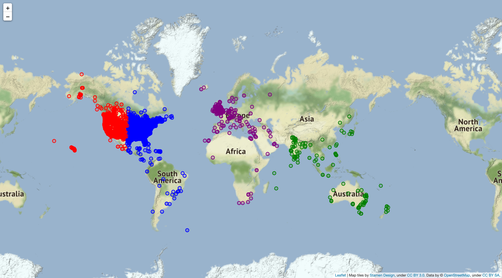

# UFO Sighting Global Cluster

## Installation
Please install these packages prior to running:
- pandas
- requests
- googlemaps
- python-dotenv
- scikit-learn
- matplotlib
- seaborn
- folium

Install either through PIP or Anaconda

### PIP Library Installation {#pip-installation}
Run this command in the terminal prior to running the project  
```pip3 install -U pandas requests googlemaps python-dotenv scikit-learn matplotlib seaborn folium```

## Requirements
- Google Maps API key  
(Only if you want to regenerate the geocode)
- Python 3.5 or More
- Jupyter Notebook (Either through anaconda or manual installation)

## Project Structure
The project is divided into 5 stages:
1. Web Scraping
2. Data Combining
3. Data Cleaning
4. Geocoding
5. Clustering

## Executing the project
In order to execute the project properly, it is essential to execute each of the notebooks and python scripts in the order below.

1. **web_scraper.py**  
> Run ```python3 web_scraper.py``` in the command-line
2. **data_combiner.ipynb**  
> Select *Run All* in data_combiner.ipynb
3. **data_cleaner.ipynb**  
> Select *Run All* in data_cleaner.ipynb
4. **geocoding.ipynb**
> Select *Run All* in geocoding.ipynb  

> **Warning**  
> Running this code takes a while and may incur cost since Google Maps uses a pay-as-you-go structure. We recommend that you use the already available [geocoded dataset](data/cleaned_ufo_data/data_geocoded.csv) in the *data* folder.

5. **clustering.ipynb**
> Select *Run All* in clustering.ipynb  

## Expected Result


The expected output of this project is an html file that contains the map with the marker to the UFO sightings that occured between January, 2020 to November, 2022. Each marker are colour coded based on what cluster they are part of.

Output:
- global_cluster.html

## Google Maps API 
If you want to try out running **geocoding.py**, you will need to acquire a Google Maps API key.
To do so, you can follow the Google's guide in this [link](https://developers.google.com/maps).  

Once you have an API key, ensure that you have the ***python-dotenv*** library installed, which should have been done if you followed the [PIP library installation guide above](#pip-installation).

Then follow this steps:
1. Add a ```.env``` file in your project directory
2. Write ```GMAPS_API_KEY={YOUR API KEY HERE}``` with your API key replacing the placeholder